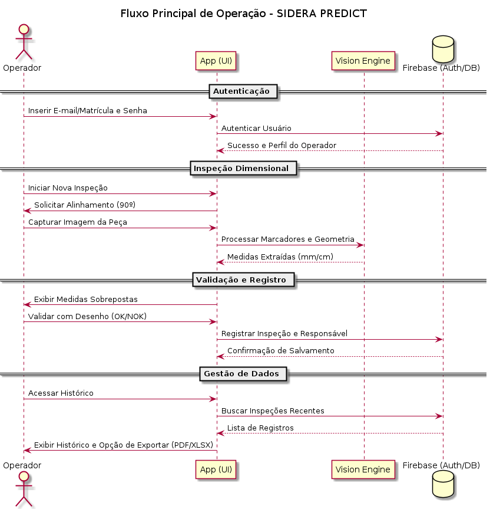
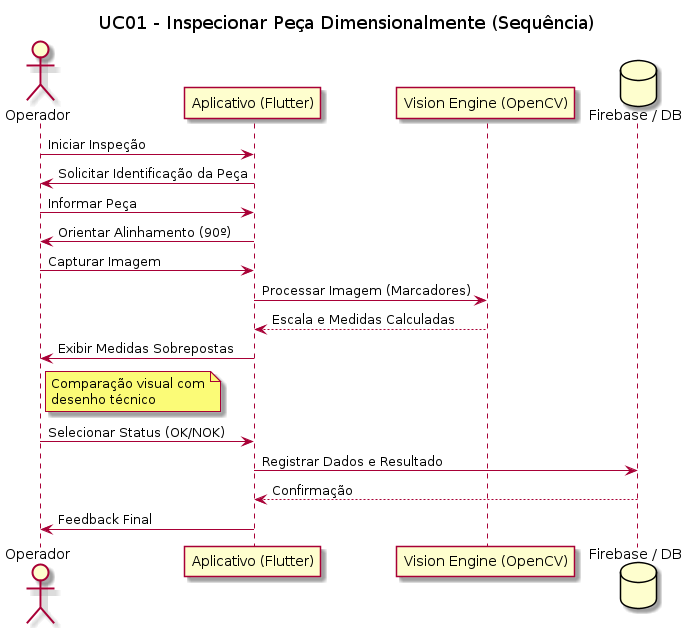
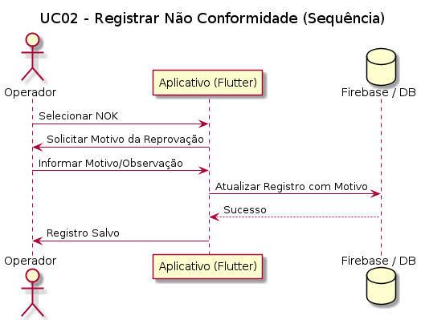
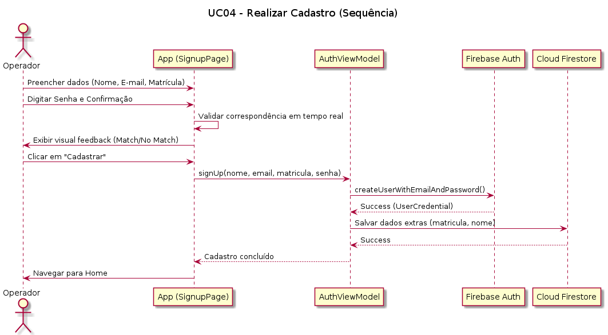
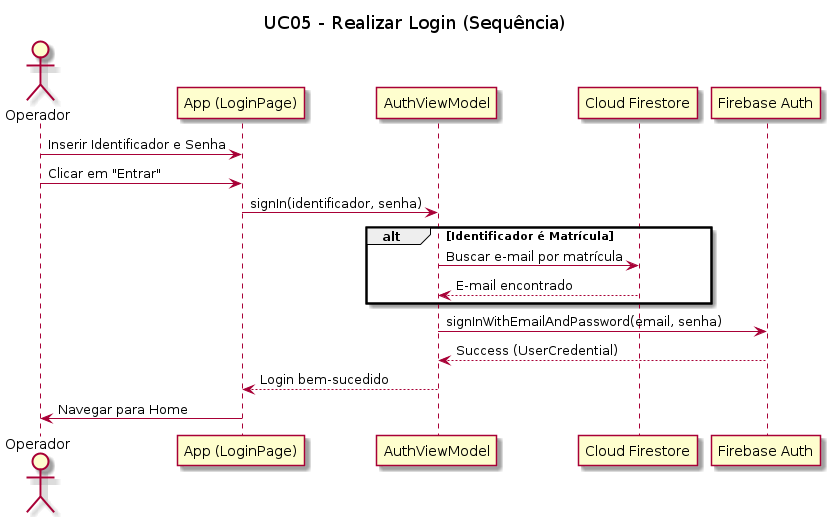
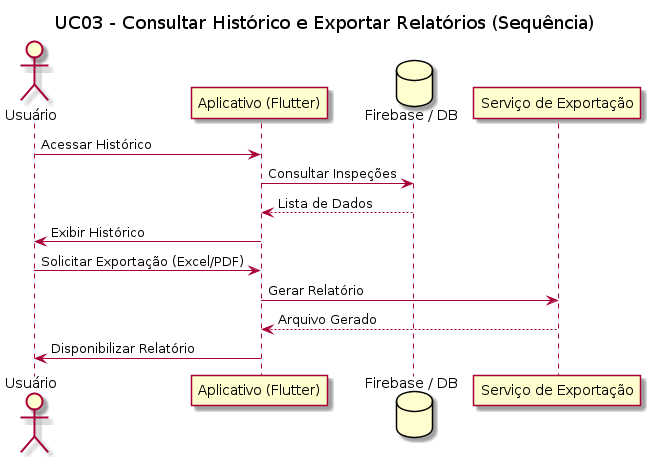

# SIDERA PREDICT — Sistema Inteligente de Inspeção Dimensional



---

## 1. Visão Geral do Projeto

O **SIDERA PREDICT** é um sistema inteligente de inspeção dimensional assistida, desenvolvido para aplicação em ambientes industriais, com foco na inspeção de peças metálicas (especialmente perfis cortados) diretamente no chão de fábrica. O projeto utiliza visão computacional baseada em marcadores para garantir precisão e confiabilidade no controle de qualidade, auxiliando o operador na validação dimensional de forma ágil e rastreável.

---

## 2. Motivação e Problema

Na indústria metalúrgica, a conformidade dimensional das peças é crítica para garantir a qualidade do produto final. Os principais problemas enfrentados atualmente incluem:

- **Erros dimensionais** (ex: ângulos fora de especificação, abas fora de medida, geometrias incorretas)
- **Inspeção manual e subjetiva**, dependente da atenção do operador e uso de ferramentas como paquímetros
- **Baixa rastreabilidade** e dificuldade em identificar a origem de falhas
- **Impacto financeiro** devido a retrabalho, devoluções e insatisfação do cliente

O SIDERA PREDICT ataca esses pontos, fornecendo uma ferramenta de medição digital que simplifica a validação e registra cada inspeção.

---

## 3. Público-Alvo

- **Operadores de Máquina:** Necessitam validar rapidamente a conformidade das peças sem interromper o fluxo produtivo.
- **Inspetores de Qualidade:** Demandam ferramentas para garantir a conformidade dimensional, com rastreabilidade e geração de relatórios.
- **Gestores Industriais:** Buscam indicadores de desempenho, redução de custos e melhoria contínua dos processos.

---

## 4. Objetivos do Sistema

O SIDERA PREDICT tem como objetivos principais:

1. Facilitar a inspeção dimensional de peças metálicas utilizando visão computacional e sistema de marcadores.
2. Garantir uma precisão de até **1,5 mm** (tolerância para corte e dobra).
3. Garantir rastreabilidade total dos resultados por meio de relatórios automáticos.
4. Fornecer feedback ao operador, delegando a comparação final ao julgamento humano assistido.
5. Gerar relatórios históricos exportáveis para Excel, PDF e bancos de dados externos.

---

## 5. Solução Proposta

O sistema consiste em um aplicativo móvel (Flutter) que utiliza:

- **Medição Dimensional Assistida:** O app extrai as medidas reais da peça capturada via câmera, utilizando um sistema de quatro marcadores físicos para calibração e sensores do celular para garantir o ângulo de 90º.
  - 
- **Interpretação e Validação:** O operador compara a medida lida pelo app com o desenho técnico e registra a conformidade ou não conformidade.
  - 
- **Gerenciamento de Acessos:** Sistema de cadastro com validação em tempo real e login unificado para garantir a segurança e a rastreabilidade individual.
  - 
  - 
- **Relatórios e Rastreabilidade:** Histórico de medições exportável com identificação automática do responsável e armazenamento em nuvem.
  - 

---

## 6. Diferenciais Técnicos

- **Precisão Industrial:** Foco em atender a tolerância de 1,5 mm exigida no chão de fábrica.
- **Execução Local (Edge AI):** Processamento rápido diretamente no dispositivo.
- **Escalabilidade Refinada:** Uso de escalas centimétricas e milimétricas nos marcadores para compensar limitações de resolução.
- **Simplicidade de Uso:** Interface otimizada para o ritmo da produção, reduzindo a dependência de ferramentas manuais.

---

## 7. Estrutura do Projeto

- Documentação acadêmica completa (casos de uso, requisitos, backlog, regras de negócio)
- Código-fonte do aplicativo móvel (Flutter)
- Sistema de relatórios e integração com banco de dados

---

## 8. Validação com o Público

O projeto foi validado com o público da empresa Soufer em uma reunião via Google
Meet com o gerente de inspeção de qualidade. Nessa validação, foram realizados
testes e cenários de uso que ajudaram a confirmar a aderência da solução ao
contexto real de aplicação.

---

## 9. Tecnologias Utilizadas

* **Framework:** Flutter (Android/iOS)
* **Visão Computacional:** OpenCV / Native Vision Engine
* **Autenticação:** Firebase Auth
* **Base de Dados:** Firebase / Cloud Firestore
* **Relatórios:** Exportação Excel/PDF / Integração DB
* **Hardware:** Dispositivos móveis (Celulares/Tablets)

---

## 10. Documentação e Padronização

Todos os documentos seguem rastreabilidade:

- RF (Requisitos Funcionais)
- RN (Regras de Negócio)
- RNF (Não Funcionais)
- UC (Casos de Uso)

---

## Documentação

- **Pasta principal de documentos:** [docs](docs/)
- **Backlog:** [docs/BACKLOG.MD](docs/BACKLOG.MD)
- **Requisitos Funcionais:** [docs/RF.MD](docs/RF.MD)
- **Regras de Negócio:** [docs/RN.MD](docs/RN.MD)
- **Requisitos Não Funcionais:** [docs/RNF.MD](docs/RNF.MD)
- **Casos de Uso:** [docs/UC.md](docs/UC.md)
- **Diagramas:** [docs/diagrams](docs/diagrams/) (fluxos, sequências e atividades)

- **Documentação do app:** [src/siderapredict/docs](src/siderapredict/docs/testes) (documentação específica do aplicativo e testes)

Consulte essas páginas para especificações, radio de aceitação, critérios de validação e diagramas de sequência.

---

## Instalação

Pré-requisitos:

- `Flutter` (recomendado: versão estável compatível com o projeto)
- `Android SDK` / `Android Studio` (para builds Android)
- `OpenCV` nativo se for necessário para compilação de bibliotecas nativas (ver `src/siderapredict/native_lib`)

Passos básicos:

1. Clone o repositório:

```
git clone <URL_DO_REPOSITORIO>
cd pi-2026.1
```

2. Entre na pasta do app Flutter e instale dependências:

```
cd src/siderapredict
flutter pub get
```

3. Build / Run (Android):

```
flutter build apk --release
flutter install # instala no dispositivo conectado
flutter run     # executa em dispositivo/emulador conectado
```

Observações:

- Se usar recursos nativos (OpenCV, bibliotecas C++), verifique `src/siderapredict/native_lib` e siga instruções locais de compilação (CMake/NDK).
- Em ambiente de desenvolvimento, `flutter run -d <device>` ou usar o Android Studio para depuração funcionam bem.

---

## Uso

Instruções rápidas de uso após instalar/rodar o app:

1. Abra o app no dispositivo.
2. Na tela inicial, faça login ou crie usuário de teste.
3. Acesse a funcionalidade de inspeção e posicione os marcadores físicos conforme instruções do equipamento.
4. Capture a imagem e aguarde o processamento; o app exibirá medidas detectadas e indicadores de conformidade.
5. Confirme/registre a inspeção e exporte o relatório via opções de exportação (Excel/PDF) disponíveis.

Comandos úteis para testes:

```
# Executar testes unitários
flutter test

# Executar testes de integração (ex.: device/emulator conectado)
flutter test integration_test
```
