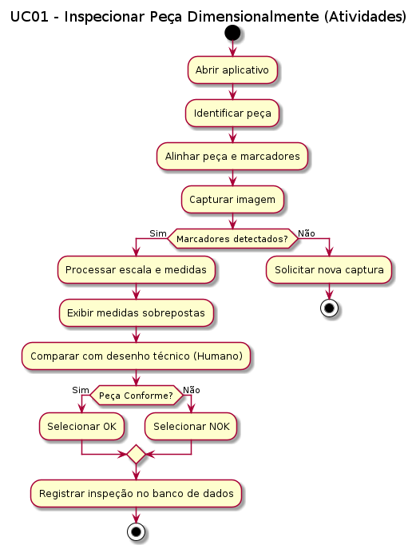
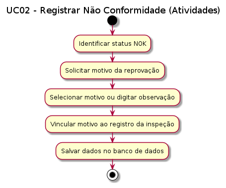
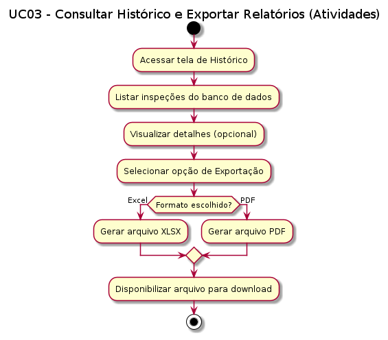
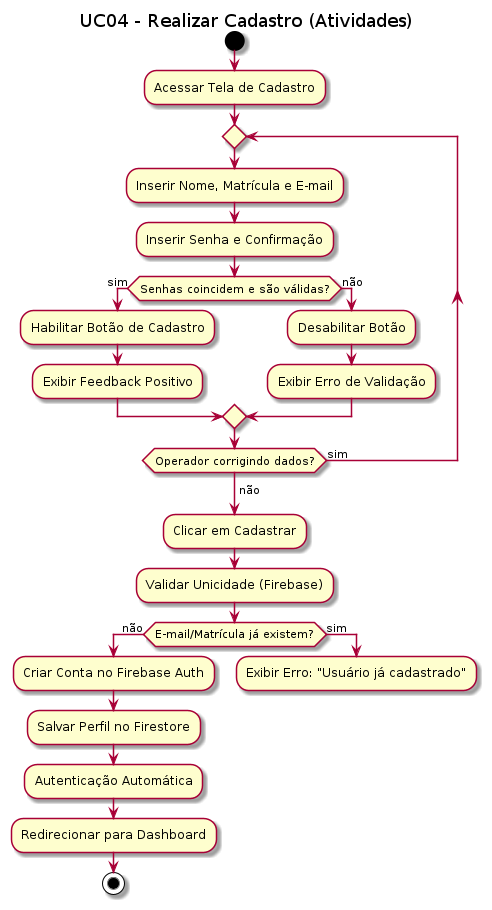
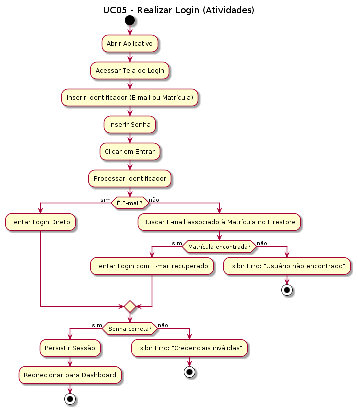

# Casos de Uso — Sistema de Inspeção Dimensional

---

## UC01 — Inspecionar Peça Dimensionalmente (Assistida)
**Descrição:** Permite ao operador medir uma peça utilizando a câmera e compará-la visualmente com o desenho técnico.

**Atores:** Operador, Sistema

**Pré-condições:**
- A peça está posicionada sobre a base de marcadores.
- O dispositivo está fixado no suporte a 90º.

**Fluxo Principal:**
1. O operador abre o aplicativo.
2. Identifica a peça que será medida.
3. O sistema orienta o enquadramento da peça e dos 4 marcadores na tela.
4. O operador captura a imagem.
5. O sistema processa os marcadores, estabelece a escala e calcula as dimensões reais (ângulos, abas, diâmetros).
6. O sistema exibe as medidas sobrepostas à imagem da peça.
7. O operador compara os valores exibidos com o desenho técnico da peça.
8. O operador seleciona o status da peça: "Conforme" (OK) ou "Não Conforme" (NOK).
9. O sistema registra automaticamente a inspeção no banco de dados, vinculando o nome do operador autenticado como responsável para garantir a rastreabilidade.

**Fluxos Alternativos:**
- 5a. Caso os marcadores não sejam detectados, o sistema solicita nova captura.

**Pós-condições:**
- Os dados da medição e o status final são salvos para rastreabilidade.

### Diagramas

---

## UC02 — Registrar Não Conformidade
**Descrição:** Permite detalhar o motivo pelo qual uma peça foi reprovada.

**Atores:** Operador, Sistema

**Pré-condições:**
- Uma medição foi realizada e o status "Não Conforme" foi selecionado.

**Fluxo Principal:**
1. O sistema solicita ao operador o motivo da reprovação (ex: Ângulo incorreto, Aba fora de medida).
2. O operador seleciona o motivo ou escreve uma breve observação.
3. O sistema vincula esse motivo ao registro da inspeção.

**Pós-condições:**
- O registro de não conformidade fica disponível no histórico para análise.

### Diagramas

---

## UC03 — Consultar Histórico e Exportar Relatórios
**Descrição:** Permite visualizar as inspeções passadas e gerar arquivos para análise externa.

**Atores:** Gestor, Inspetor de Qualidade

**Pré-condições:**
- Existem inspeções registradas no sistema.

**Fluxo Principal:**
1. O usuário acessa a tela de Histórico.
2. O sistema exibe a lista de inspeções realizadas.
4. O usuário seleciona a opção "Exportar para Excel" ou "Exportar para PDF".
5. O sistema gera e disponibiliza o arquivo de relatório.

**Pós-condições:**
- Relatório exportado com sucesso.

### Diagramas

---

## UC04 — Realizar Cadastro
**Descrição:** Permite que um novo operador crie uma conta no sistema.

**Atores:** Operador, Sistema

**Fluxo Principal:**
1. O operador acessa a tela de cadastro.
2. O operador insere seu nome completo, matrícula e e-mail.
3. O operador define uma senha e a confirma no campo abaixo.
4. O sistema valida em tempo real se as senhas coincidem e se atendem aos requisitos mínimos, fornecendo feedback visual imediato.
5. O sistema valida se a matrícula e o e-mail já não estão em uso ao tentar submeter.
6. O sistema cria a conta e autentica o usuário automaticamente.
7. O sistema redireciona para o painel principal.

**Fluxos Alternativos:**
- 3a. Caso o e-mail ou matrícula já existam, o sistema exibe mensagem de erro e solicita correção.

**Pós-condições:**
- O novo usuário é registrado no banco de dados e autenticado.

### Diagramas

---

## UC05 — Realizar Login
**Descrição:** Permite que um operador autenticado acesse suas informações e histórico.

**Atores:** Operador, Sistema

**Fluxo Principal:**
1. O operador abre o aplicativo na tela de login.
2. O operador insere seu identificador (E-mail ou Matrícula) em um único campo.
3. O operador insere sua senha.
4. O sistema valida as credenciais via Firebase Auth.
5. O sistema carrega o perfil do usuário e seu nome.
6. O sistema redireciona para o painel principal.

**Fluxos Alternativos:**
- 3a. Caso as credenciais sejam inválidas, o sistema exibe mensagem de erro.

**Pós-condições:**
- O usuário ganha acesso às funcionalidades restritas e histórico personalizado.

### Diagramas

---
